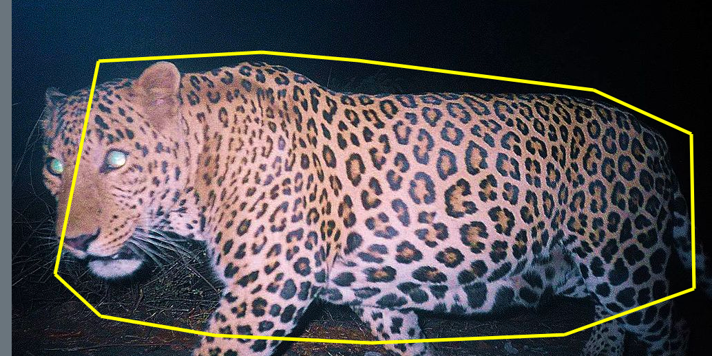
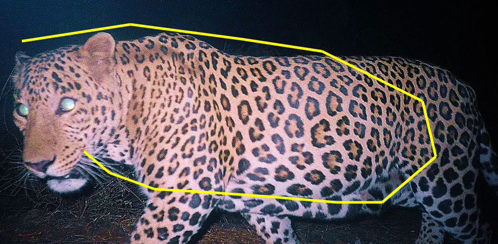
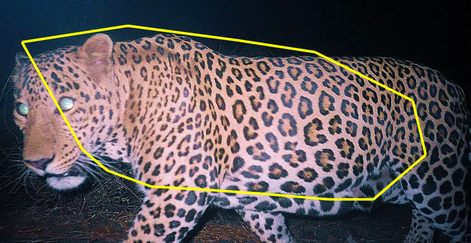

# Test Conabio TAG poligono

## Contenido

- Introduccion
- Uso

## Introduccion

La idea este test fue la de impleantar un funcionalidad que permitiera crear un poligo sobre un canvas.



## Uso

Para generar el poligono solo hay que dar click sobre la imagen, la funcionalidad se encarcara de crear las lineas.



Para cerrar el poligono lo cerramos con boton derecho del mouse.



## Ejecutar

Para ejecutar el proyecto debemos ejecutar 2 comandos.

Para installar las dependecias necesarias.

```
$ npm install

```

Para iniciar el projecto

```
$ npm start
```

Una vez inicado el proyecto podemos ver el servicio en la siguente direcccion http://localhost:9000/

**_nota: el puerto 9000 no debe estar en uso_**
